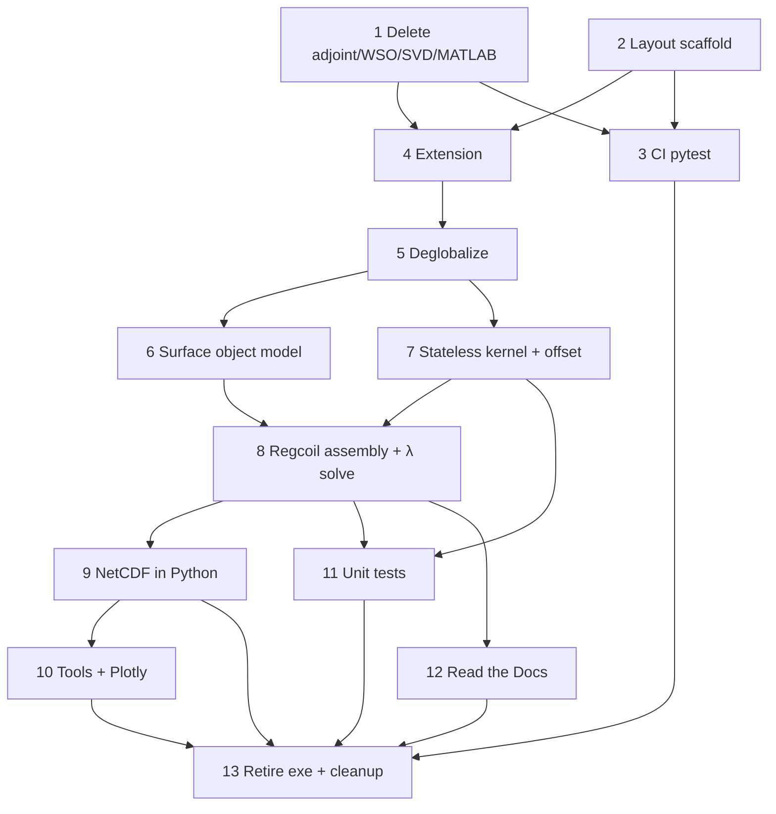

# Migration phases

Ordered work packages for the overhaul. Each phase should be a reviewable PR (or a short stack). Update the status column as work lands.

> **Architecture pivot (2026-07-18).** Phases 6+ were re-planned to match the
> object-model / stateless-Fortran-kernel design in [API.md](API.md) (ADR-019,
> ADR-020, ADR-021, ADR-022). The pending-phase list below replaces the earlier
> "namelist/JSON driver → SciPy Brent → NetCDF" plan. Phases 0–5 stay as
> completed; see **Reconciliation with completed phases 4–5** below for what of
> that work is superseded and where it is removed.

| Phase | Status | Depends on |
|-------|--------|------------|
| 0 Inventory freeze | done (see INVENTORY.md) | — |
| 1 Delete adjoint / WSO / SVD / MATLAB (except plotly port source) | done | — |
| 2 Layout + packaging scaffold | done | — |
| 3 CI + pytest scaffold | done | 2 helpful; can start after 1 |
| 4 Fortran as library + Python bindings (still may use globals) | done | 1, 2 |
| 5 Deglobalize Fortran state (instances) | done | 4 |
| 6 Python surface object model (`Surface`/`FourierSurface`/`Plasma`/`Coil`) | done | 5 (mostly independent) |
| 7 Slim stateless Fortran kernel + offset surface | done | 5 |
| 8 Python `Regcoil` assembly + λ-family solve | pending | 6, 7 |
| 9 NetCDF I/O in Python; strip Fortran NetCDF/LAPACK | pending | 8 |
| 10 Package tools (plot, compare, cut) + Plotly coil plot | pending | 9 helpful |
| 11 Unit tests (Python + Fortran kernels) | pending | 7+; continuous afterward |
| 12 Read the Docs manual | pending | 8 helpful |
| 13 Retire Fortran executable + delete legacy Fortran + final cleanup | pending | 8–12, CI green |

---

## Reconciliation with completed phases 4–5

Phases 4–5 wrapped the **existing** in-Fortran pipeline (`regcoil_build_matrices`,
`regcoil_prepare_solve`, `regcoil_solve`, `regcoil_diagnostics`) behind an opaque
`type(regcoil_t)` handle and a handle-based C API (`regcoil_c_create`,
`regcoil_c_setup`, `regcoil_c_solve_lambda`, …). The new architecture narrows the
Fortran boundary to 2–3 **stateless pure functions** and moves every matrix
product, the solve, the diagnostics, and the λ scan to numpy/scipy. Therefore:

- `regcoil_variables.f90`, the `regcoil_t` handle API, and the in-Fortran
  solve/prepare/diagnostics are **superseded** (ADR-018 → ADR-020) and get removed
  across Phases 7–9 and 13 — not carried forward.
- `iso_c_binding` + `regcoil._core` (ADR-017) and `meson-python` (ADR-002) **stay**;
  only the *number and shape* of entry points change (from a stateful handle to
  stateless kernels).
- Keep the legacy Fortran `program regcoil` and its NetCDF output building until
  Python-path parity is proven (ADR-006), then remove in Phase 13.

---

## Phase 0 — Inventory freeze

**Done** in [INVENTORY.md](INVENTORY.md).

Exit criteria:

- [x] Module roles listed.
- [x] Kill lists for adjoint / WSO / SVD / MATLAB.
- [x] NetCDF and globals touch points noted.

---

## Phase 1 — Remove adjoint, WSO, SVD scan, and MATLAB (bulk)

**Intent:** Shrink scope before wrapping and packaging.

**Delete / stop compiling:**

- Adjoint / sensitivity: `regcoil_adjoint_solve.f90`, `regcoil_init_sensitivity.f90`, `regcoil_fixed_norm_sensitivity.f90`, related branches, namelist keys, `manual/adjoint.tex`
- `windingSurfaceOptimization/` (entire tree)
- SVD: `regcoil_svd_scan.f90`, `general_option == 3` paths, related validate/output branches
- MATLAB: all `*.m` including `coilMetricScripts/`, `regcoil.m`, `m20160811_02_*.m`
  - **Exception:** keep `m20160811_01_plotCoilsFromRegcoil.m` only until Phase 9 ports it to Plotly, then delete

Exit criteria:

- [x] No sensitivity / adjoint / SVD scan in the default build.
- [x] Non-deleted examples still pass via current `make test` (or successor).
- [x] MATLAB tree gone except the temporary Plotly-port source (or already ported).

---

## Phase 2 — Directory layout and packaging scaffold

**Intent:** Introduce the target tree without changing physics.

```text
pyproject.toml
src/regcoil/            # Python package
fortran/                # REGCOIL + trimmed mini_libstell
tests/                  # pytest (unit + integration)
examples/               # regression cases
docs/                   # RTD sources + migration/
.github/workflows/      # CI
```

Allowed runtime deps in `pyproject.toml`: `numpy`, `scipy`, `matplotlib`, `f90nml`, `plotly`, optional `netCDF4`. Dev: `pytest`. No SIMSOPT/DESC.

Exit criteria:

- [x] `pyproject.toml` + build-backend choice recorded (ADR-002).
- [x] Layout in place; README has install/dev stubs.
- [x] Dependency list matches [OVERVIEW.md](OVERVIEW.md) principles.

---

## Phase 3 — GitHub Actions + pytest scaffold

**Intent:** CI early; migrate example runner toward pytest.

Today: `make test` → `examples/runExamples.py`. Legacy docs workflow `publish_manual.yml` is removed in Phase 11 (do not extend it).

CI strategy (ADR-016): build the legacy Fortran executable and run pytest smoke on both `ubuntu-latest` and `macos-latest`. Full example regressions stay local (`make test`) for now; wire them into GHA in a later pass.

Exit criteria:

- [x] GHA builds on `ubuntu-latest` (gfortran, BLAS/LAPACK; NetCDF Fortran only until Phase 8).
- [x] GHA builds on `macos-latest`.
- [x] pytest discovers at least a smoke test (example suite in CI deferred; see ADR-016).

---

## Phase 4 — Fortran library + Python extension

**Intent:** Importable extension; old executable may remain for parity.

Expose: build matrices, prepare/solve, per-λ diagnostics / residual metrics.

Globals may still exist here; Phase 5 removes them.

Exit criteria:

- [x] `import regcoil._core` (or similar) works after `pip install`.
- [x] One-λ solve matches a known example within tolerance.
- [x] CI installs via pip, not hand-invoked makefile alone.

---

## Phase 5 — Deglobalize Fortran state

**Intent:** Multiple independent problem instances in one process.

Replace `regcoil_variables` module globals with a derived type (or explicit argument bundles) passed through the call chain. Python mirrors this with `RegcoilProblem` holding extension state / handle.

Exit criteria:

- [x] No mutable problem state in Fortran `module` variables for normal solves.
- [x] Test: two instances with different resolutions/λ produce correct, non-interfering results.
- [x] Documented pattern for new Fortran routines (state as first argument / type components).

See ADR-018 for nested types (`plasma` / `coil` / `input` / `output` / `work`), opaque C handles, and the `prob`-first calling convention.

---

## Phase 6 — Python surface object model

**Intent:** The user-facing geometry layer, in pure Python/numpy, replacing the
Fortran geometry-init and the input-file readers. No Fortran dependency (except
`from_uniform_offset`, which lands in Phase 7).

- `Surface` (ABC): the contract is `_evaluate(theta, zetal) -> {r, drdtheta,
  drdzeta}`, each `(3, ntheta, nzetal)`, Cartesian. Base class supplies `normal`,
  `norm_normal`, `area`, `volume`, `dtheta`, `dzeta`, the grids, and plotting.
  **No `nderiv` / second derivatives** (Laplace–Beltrami removed, ADR-022).
- `FourierSurface(Surface)`: holds `mnmax, xm, xn, rmnc, rmns, zmnc, zmns`;
  `_evaluate` is the numpy gemm. Alternate constructors (classmethods) replace the
  `geometry_option_*` codes: `circular_torus`, `from_vmec` (`mesh="full"|"half"`,
  `straight_field_line=`), `from_ascii_table`, `from_focus`,
  `from_nescin`. VMEC `wout` / nescin / FOCUS reading is **Python** (ADR-004 lib).
- `PlasmaSurface(FourierSurface)`: `Bnormal_from_plasma_current` via bnorm file
  (`set_bnormal_from_bnorm_file`), FOCUS modes, or user array;
  `net_poloidal_current_Amperes`, `curpol`.
- `CoilSurface(FourierSurface)`: coil-side Fourier filtering; `from_uniform_offset`
  wired in Phase 7.
- Qualitative options are **string enums** in the Python API (carries forward the
  string-option spirit of ADR-009; the namelist/integer-translation machinery is
  dropped with ADR-019).

Exit criteria:

- [x] `PlasmaSurface.from_vmec(...)` and `CoilSurface.from_nescin(...)` reproduce
      the legacy surface grids (`r`, `normal`, `area`) within tolerance.
- [x] `circular_torus`, `from_focus`, bnorm loading covered by unit tests.
- [x] `_evaluate` numpy gemm matches a small hand-checked case; `xn`/`nfp` and
      `m·θ − n·ζ` conventions asserted (see [API.md](API.md) conventions).

**Status: done.** `Surface` (ABC), `FourierSurface`, `PlasmaSurface`, `CoilSurface`
implemented in `src/regcoil/{surface,fourier_surface,plasma_surface,coil_surface,_io}.py`,
exported from `regcoil/__init__.py`. Constructors landed: `circular_torus`,
`from_vmec` (`mesh="full"|"half"`), `from_ascii_table`, `from_focus` (surface +
Bnormal modes), `from_nescin`, plus `set_bnormal_from_bnorm_file` and coil-side
`filter_modes`. `r`/`normal`/`area`/`volume` for `from_vmec` and `from_nescin`
are checked in `tests/unit/` against the legacy Fortran (`regcoil_init_plasma`/
`regcoil_init_coil_surface`, compiled standalone and run outside the package
build for comparison, since this exit criteria doesn't require the (still
unbuilt) `_core` extension). **Not implemented, by design (see ADR-023):**
`from_efit` (legacy dropped EFIT support, no reference to validate against),
`from_vmec(straight_field_line=True)` (legacy root-solve not robust enough to
port with confidence), `CoilSurface.from_uniform_offset` (needs the Fortran
kernel added in Phase 7, per the original plan).

---

## Phase 7 — Slim stateless Fortran kernel + offset surface

**Intent:** Shrink the Fortran boundary to 2–3 **pure** functions; retire the
globals-coupled build and the in-Fortran solve chain.

- `regcoil_build_g_and_h`: fused `inductance @ basis_functions` → `g`, `h`.
  Blocked internal loop (DGEMM per plasma-row chunk -- faster than the
  `matmul` intrinsic), OpenMP over plasma rows, GIL released (threadsafe).
  `intent(in)/(out)` only, extents explicit, **`info`** return, no `stop`, no
  module state.
- `regcoil_build_inductance`: same args minus `basis_functions`, returns the full
  matrix — a **separate** debug/regression entry point.
- `regcoil_uniform_offset_surface`: returns **Fourier coefficients**
  (`mnmax_out = mpol_out*(2*ntor_out+1) + ntor_out + 1`, deterministic), so a
  uniform-offset coil is an ordinary `FourierSurface`. Wire
  `CoilSurface.from_uniform_offset`.
- Extend the `bind(C)` layer (`fortran/regcoil_c_api.f90`, `src/regcoil/_core.c`)
  with these stateless entry points; a nonzero `info` becomes a Python exception.
  Assert `f_contiguous` at the boundary.
- Begin removing the superseded path: stop compiling `regcoil_variables`-coupled
  `regcoil_build_matrices`/`prepare_solve`/`solve`/`diagnostics` from the extension
  (final deletion in Phase 13; the legacy executable may still use them per ADR-006).
  Audit `regcoil_fzero.f`: keep only if the offset root-solve needs it.

Exit criteria:

- [x] `build_g_and_h(...)` equals `build_inductance(...) @ basis_functions` within
      tolerance on a manufactured case.
- [x] `uniform_offset_surface(...)` coefficients match the legacy offset routine.
- [x] `build_g_and_h(...)` output matches golden reference output of legacy Fortran routine
      within tolerance on a small case.
- [x] Unit tests for `regcoil_fzero.f`, assuming it is kept for `uniform_offset_surface(...)`.
- [x] Kernels are callable from `regcoil._core` with no persistent Fortran state;
      two concurrent calls with different sizes do not interfere.

**Status: done.** `regcoil_build_inductance` and `regcoil_build_g_and_h`
(`fortran/regcoil_kernels_mod.f90`) and `regcoil_uniform_offset_surface`
(`fortran/regcoil_uniform_offset_surface_mod.f90`) are pure/stateless: explicit
extents, `info` return, no `stop`, no module state, OpenMP over plasma rows
(`build_g_and_h`) or grid points (`uniform_offset_surface`). `build_g_and_h`
contracts one plasma-row chunk at a time against DGEMM (chosen over the
`matmul` intrinsic for performance), so the full inductance matrix is never
materialized; `regcoil_fzero.f` is kept and exercised by
`uniform_offset_surface`'s per-point root solve. `fortran/regcoil_c_api.f90` /
`src/regcoil/_core.c` expose all three as module-level `regcoil._core`
functions (no opaque handle -- ADR-020 supersedes the Phase 5 handle API, so
`RegcoilProblem` and its namelist-driven setup/solve chain are removed, along
with `tests/test_core_one_lambda.py`); a nonzero Fortran `info` becomes a
Python exception, and large arrays (`r_plasma`, `r_coil`, `basis_functions`,
...) must already be float64/Fortran-contiguous (`ValueError`/`TypeError`
otherwise, no silent copy) while small mode-number/coefficient arrays are cast
for convenience. `fortran/meson.build`'s extension source list is slimmed to
just what these kernels need (`regcoil_fzero.f`, the two new kernel modules,
`regcoil_c_api.f90`, plus `stel_kinds`/`stel_constants`); the
`regcoil_variables`-coupled build/solve chain, VMEC/nescin/bnorm reading, and
NetCDF modules are no longer compiled into the extension (still built for the
legacy executable via the makefile's own source list, untouched, per ADR-006).
`CoilSurface.from_uniform_offset` is wired in `src/regcoil/coil_surface.py`.
Golden values in `tests/unit/_golden_kernels.py` were generated the same way
as Phase 6's (a standalone driver linking the legacy
`regcoil_build_matrices` / `regcoil_init_coil_surface`, compiled and run
outside the package build); `tests/unit/test_kernels.py` checks
`build_g_and_h` against `build_inductance(...) @ basis_functions`, both
against the golden legacy values, `uniform_offset_surface` against a
non-circular (helical-bump) golden legacy case that forces a genuine
`regcoil_fzero` root solve, an exact analytic circular-torus check, the
`CoilSurface.from_uniform_offset` wiring, boundary-validation error paths, and
non-interference across two different problem sizes.

---

## Phase 8 — Python `Regcoil` assembly + λ-family solve

**Intent:** Assemble and solve entirely in numpy/scipy; the λ scan and target
search are free after one eigendecomposition. Replaces the former "SciPy Brent"
phase (ADR-021 supersedes ADR-003).

- `Regcoil(plasma, coil, mpol_potential, ntor_potential, net_poloidal_current,
  net_toroidal_current, symmetry)`: builds `basis_functions` and the potential
  modes (numpy), calls `regcoil_build_g_and_h` for `g`/`h`, forms
  `matrix_B = gᵀ(g/N)`, `matrix_K = Σ fᵢᵀ(fᵢ/N)`, `RHS_B`, `RHS_K`, and computes
  `w, V = scipy.linalg.eigh(matrix_B, matrix_K)`. **Immutable** thereafter.
- `Solution` (frozen dataclass): `lam`, `solution`,
  `single_valued_current_potential_mn`, `chi2_B`, `chi2_K`, `max_K`, `rms_K`,
  `max_Bnormal`, `Bnormal_total`; lazy `current_potential()` / `current_density()`.
- `solve(lam)`, `scan(lambdas)` (vectorized), `solve_for_target(metric, value)`
  (bisection/Newton on the closed-form `chi2`/`max_K` vs λ). No Fortran Brent,
  no `regcoil_lambda_scan`, no `regcoil_auto_regularization_solve`.
- Keep the non-stellarator-symmetry option (`symmetry` ∈ {`stellarator_symmetric`,
  `cos_only`, `both`}, ADR-019).
- For tests that the new python-based solver matches the legacy fortran solver,
  you can use existing golden reference values from the files
  /examples/*/tests.py, as the reference values in those files were taken by
  hand from the fortran solver.
- Re-wire the regression tests in /tests/regression to use the new python solver
  instead of the legacy fortran solver. Mark the tests with ntheta_plasma=128 as
  "slow" in pytest and the github actions CI skips these tests, but they are
  available for a user to run by hand if desired.
- For the lambda-search examples in /examples, the order of lambda values for
  the search will almost certainly be different with the new python solver than
  with the legacy Fortran solver, so tests can cover just the final converged
  value of lambda, and if possible the large-lambda and zero-lambda limits, but
  the intermediate lambda values and the specific order of lambda values may
  differ.

Exit criteria:

- [ ] One-λ solve matches a legacy example within tolerance.
- [ ] `scan(...)` matches per-λ direct solves; `solve_for_target(...)` matches the
      legacy `lambda_search_*` results within tolerance.
- [ ] Two `Regcoil` instances with different resolutions coexist and don't
      interfere (no shared state, kernel is stateless).
- [ ] Regression tests in /tests/regression/ pass, use the new python solver,
      and all asserted values from the /examples/*/tests.py files are encoded in
      the tests/regression/ tests, except that non-converged lambda values may
      be skipped in the lambda-scan examples.

---

## Phase 9 — NetCDF I/O in Python; strip Fortran NetCDF/LAPACK

**Intent:** All I/O in Python; the extension links only the Fortran runtime,
OpenMP, and BLAS (library choice: ADR-004). BLAS stays because
`regcoil_build_g_and_h` (Phase 7) uses DGEMM; LAPACK and NetCDF do not have an
equivalent permanent consumer and go away.

1. `Solution.save(path)` writes `regcoil_out.*.nc` from Python (and a reader for
   tools/tests).
2. VMEC `wout` ingest is already Python (Phase 6); confirm no Fortran NetCDF is
   reached on the supported path.
3. Strip `ezcdf` / `NETCDF` and the NetCDF `read_wout` path from the extension.
4. Remove `mini_libstell`, relocating any essential kinds/constants and anything
   else necessary to the fortran files that will be kept in the end.  — see ADR-005.

Exit criteria:

- [ ] Extension links only the compiler runtime, OpenMP, and BLAS (no LAPACK, no NetCDF).
- [ ] Tests read outputs via the chosen Python NetCDF stack.
- [ ] CI does not install Fortran NetCDF for the package build.

---

## Phase 10 — Package tools + Plotly coil visualization

**Intent:** First-class Python tooling; no standalone script requirement; no MATLAB left.

Fold into `regcoil` (CLI entry points TBD):

- `regcoilPlot` → matplotlib-based plotting module
- `compareRegcoil` → compare module
- `cutCoilsFromRegcoil` / `cut_saddle_coil` → coil cutting module(s)

Port `m20160811_01_plotCoilsFromRegcoil.m` → Plotly; then delete that `.m` file.

Exit criteria:

- [ ] Tools importable and invocable via console scripts.
- [ ] Plotly coil figure works against a sample `regcoil_out`.
- [ ] Zero `*.m` files in the repo.

---

## Phase 11 — Unit tests (ongoing)

**Intent:** Not only example regressions.

- **Python:** pytest unit tests for the surface object model (`_evaluate` gemm,
  `normal`/`area`/`volume`, constructors, conventions), Bnormal loaders, basis-
  function / matrix assembly, the closed-form λ family vs direct solves, and
  NetCDF round-trip; plotting smoke (non-interactive backends).
- **Fortran kernels:** exercise `build_g_and_h` / `build_inductance` /
  `uniform_offset_surface` via `regcoil._core` with small manufactured inputs
  **or** a Fortran unit-test framework (ADR-008). Prefer minimal new deps.

Exit criteria:

- [ ] Documented `pytest` layout under `tests/`.
- [ ] At least a handful of true unit tests (not only full examples) for the
      Python object model and for the Fortran kernels.
- [ ] CI runs unit + example suites.

---

## Phase 12 — Read the Docs manual

**Intent:** Replace LaTeX `manual/` and remove the old docs GitHub Actions workflow.

- Sphinx (or MkDocs) under `docs/`; RTD config; port content from `overview.tex`, `inputParameters.tex`, etc.
- Retire `manual/` as canonical docs.
- **Delete** `.github/workflows/publish_manual.yml` (LaTeX → gh-pages). Do not keep or adapt that workflow; docs publishing is via Read the Docs (and optionally a lightweight CI docs-build check that is not `publish_manual.yml`).

Exit criteria:

- [ ] Docs build on RTD (or equivalent non-`publish_manual` CI job).
- [ ] Reference documents the object-model API (surfaces, `Regcoil`, `Solution`)
      and the string options; no namelist/JSON input reference.
- [ ] LaTeX manual no longer the canonical user doc.
- [ ] `.github/workflows/publish_manual.yml` is removed from the repo.

---

## Phase 13 — Retire executable, delete legacy Fortran, final cleanup

Exit criteria:

- [ ] Fortran `program regcoil` removed or unsupported.
- [ ] `regcoil_variables.f90`, the `regcoil_t` handle API, and the in-Fortran
      solve/prepare/diagnostics + λ-search sources are deleted (superseded by the
      stateless kernels and the numpy/scipy solve).
- [ ] mini_libstell is completely removed.
- [ ] Packaging is the canonical build; makefile gone or developer-only.
- [ ] README points at pip install, the scripting API, pytest, and RTD.
- [ ] `publish_manual.yml` already gone (Phase 12); no leftover gh-pages LaTeX publish path.
- [ ] Open ADRs resolved or explicitly deferred; migration docs marked complete.

---

## Parallelism notes



Phases 6 and 7 run in parallel (Python geometry vs Fortran kernel) and converge at
Phase 8. Phase 11 starts as soon as the surfaces and kernels exist and grows
continuously. Phase 10 can begin once NetCDF outputs are stable from Python.
