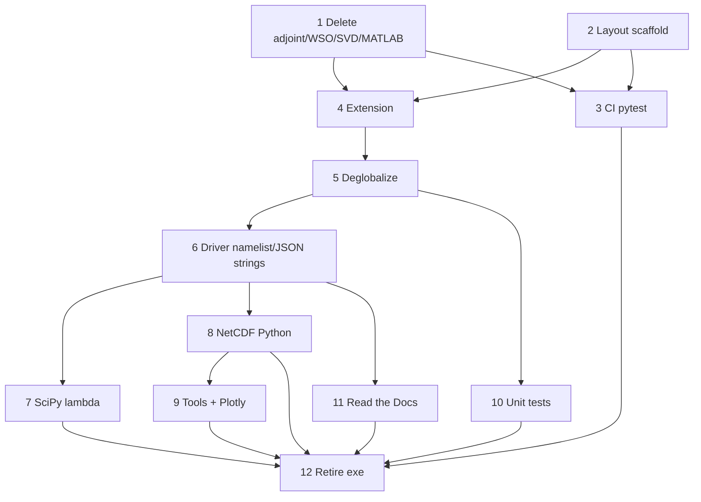

# Migration phases

Ordered work packages for the overhaul. Each phase should be a reviewable PR (or a short stack). Update the status column as work lands.

| Phase | Status | Depends on |
|-------|--------|------------|
| 0 Inventory freeze | done (see INVENTORY.md) | — |
| 1 Delete adjoint / WSO / SVD / MATLAB (except plotly port source) | done | — |
| 2 Layout + packaging scaffold | done | — |
| 3 CI + pytest scaffold | pending | 2 helpful; can start after 1 |
| 4 Fortran as library + Python bindings (still may use globals) | pending | 1, 2 |
| 5 Deglobalize Fortran state (instances) | pending | 4 |
| 6 Python driver + namelist/JSON input + string options | pending | 5 |
| 7 SciPy lambda search | pending | 6 |
| 8 NetCDF I/O in Python only | pending | 6 |
| 9 Package tools (plot, compare, cut) + Plotly coil plot | pending | 8 helpful |
| 10 Unit tests (Python + Fortran cores) | pending | 5+; continuous afterward |
| 11 Read the Docs manual | pending | 6 helpful |
| 12 Retire Fortran executable + final cleanup | pending | 7–11, CI green |

---

## Phase 0 — Inventory freeze

**Done** in [INVENTORY.md](INVENTORY.md).

Exit criteria:

- [x] Module roles listed.
- [x] Kill lists for adjoint / WSO / SVD / MATLAB.
- [x] NetCDF and globals touch points noted.

---

## Phase 1 — Remove adjoint, WSO, SVD scan, and MATLAB (bulk)

**Intent:** Shrink scope before wrapping and packaging.

**Delete / stop compiling:**

- Adjoint / sensitivity: `regcoil_adjoint_solve.f90`, `regcoil_init_sensitivity.f90`, `regcoil_fixed_norm_sensitivity.f90`, related branches, namelist keys, `manual/adjoint.tex`
- `windingSurfaceOptimization/` (entire tree)
- SVD: `regcoil_svd_scan.f90`, `general_option == 3` paths, related validate/output branches
- MATLAB: all `*.m` including `coilMetricScripts/`, `regcoil.m`, `m20160811_02_*.m`
  - **Exception:** keep `m20160811_01_plotCoilsFromRegcoil.m` only until Phase 9 ports it to Plotly, then delete

Exit criteria:

- [x] No sensitivity / adjoint / SVD scan in the default build.
- [x] Non-deleted examples still pass via current `make test` (or successor).
- [x] MATLAB tree gone except the temporary Plotly-port source (or already ported).

---

## Phase 2 — Directory layout and packaging scaffold

**Intent:** Introduce the target tree without changing physics.

```text
pyproject.toml
src/regcoil/            # Python package
fortran/                # REGCOIL + trimmed mini_libstell
tests/                  # pytest (unit + integration)
examples/               # regression cases
docs/                   # RTD sources + migration/
.github/workflows/      # CI
```

Allowed runtime deps in `pyproject.toml`: `numpy`, `scipy`, `matplotlib`, `f90nml`, `plotly`, optional `netCDF4`. Dev: `pytest`. No SIMSOPT/DESC.

Exit criteria:

- [x] `pyproject.toml` + build-backend choice recorded (ADR-002).
- [x] Layout in place; README has install/dev stubs.
- [x] Dependency list matches [OVERVIEW.md](OVERVIEW.md) principles.

---

## Phase 3 — GitHub Actions + pytest scaffold

**Intent:** CI early; migrate example runner toward pytest.

Today: `make test` → `examples/runExamples.py`. Docs-only workflow: `publish_manual.yml`.

Exit criteria:

- [ ] GHA builds on `ubuntu-latest` (gfortran, BLAS/LAPACK; NetCDF Fortran only until Phase 8).
- [ ] pytest discovers at least a smoke test; example suite runs in CI (legacy exe acceptable initially).
- [ ] PR failures block merge.

---

## Phase 4 — Fortran library + Python extension

**Intent:** Importable extension; old executable may remain for parity.

Expose: build matrices, prepare/solve, per-λ diagnostics / residual metrics.

Globals may still exist here; Phase 5 removes them.

Exit criteria:

- [ ] `import regcoil._core` (or similar) works after `pip install`.
- [ ] One-λ solve matches a known example within tolerance.
- [ ] CI installs via pip, not hand-invoked makefile alone.

---

## Phase 5 — Deglobalize Fortran state

**Intent:** Multiple independent problem instances in one process.

Replace `regcoil_variables` module globals with a derived type (or explicit argument bundles) passed through the call chain. Python mirrors this with `RegcoilProblem` holding extension state / handle.

Exit criteria:

- [ ] No mutable problem state in Fortran `module` variables for normal solves.
- [ ] Test: two instances with different resolutions/λ produce correct, non-interfering results.
- [ ] Documented pattern for new Fortran routines (state as first argument / type components).

---

## Phase 6 — Python driver, namelist + JSON, string options

**Intent:** Python owns the run loop; inputs are less error-prone.

- Parse namelist with **`f90nml`**; also accept **JSON** with the same schema (field names aligned).
- Qualitative options as **strings** (e.g. run mode, geometry kind, symmetry, target metric)—see [API.md](API.md) and ADR-009.
- Dispatch: λ scan, nescout diagnostics, auto-regularization (**not** SVD).

Exit criteria:

- [ ] CLI / `run(path)` works for `.nml`-style and `.json` inputs.
- [ ] Example regressions pass on the Python path (exe optional).
- [ ] Integer qualitative codes no longer required in new inputs; legacy handling documented.

---

## Phase 7 — SciPy lambda search

**Intent:** Root-finding in Python; physics residual is a callback.

Port staging/bracketing from `regcoil_auto_regularization_solve.f90`; use `scipy.optimize.brentq` / `root_scalar`. Audit `regcoil_fzero.f` call sites (geometry roots may stay or move separately).

Exit criteria:

- [ ] Auto-λ does not require Fortran Brent.
- [ ] `lambda_search_*` examples pass.
- [ ] Residual is unit-testable.

---

## Phase 8 — NetCDF I/O entirely in Python

**Intent:** Drop NetCDF from the Fortran build (library choice: ADR-004).

1. Python writes `regcoil_out.*.nc`.
2. Python reads VMEC NetCDF `wout` (when needed) and passes coefficients in.
3. Strip `ezcdf` / `NETCDF` from the extension.

Exit criteria:

- [ ] Extension links only BLAS/LAPACK (+ runtime).
- [ ] Tests read outputs via the chosen Python NetCDF stack.
- [ ] CI does not install Fortran NetCDF for the package build.

---

## Phase 9 — Package tools + Plotly coil visualization

**Intent:** First-class Python tooling; no standalone script requirement; no MATLAB left.

Fold into `regcoil` (CLI entry points TBD):

- `regcoilPlot` → matplotlib-based plotting module
- `compareRegcoil` → compare module
- `cutCoilsFromRegcoil` / `cut_saddle_coil` → coil cutting module(s)

Port `m20160811_01_plotCoilsFromRegcoil.m` → Plotly; then delete that `.m` file.

Exit criteria:

- [ ] Tools importable and invocable via console scripts.
- [ ] Plotly coil figure works against a sample `regcoil_out`.
- [ ] Zero `*.m` files in the repo.

---

## Phase 10 — Unit tests (ongoing)

**Intent:** Not only example regressions.

- **Python:** pytest unit tests for input parsing (namelist/JSON), option validation, lambda residual helpers, NetCDF round-trip, plotting smoke (non-interactive backends).
- **Fortran cores:** tests that exercise matrix/solve via the Python extension **or** a Fortran unit-test framework (ADR-008). Prefer minimal new deps.

Exit criteria:

- [ ] Documented `pytest` layout under `tests/`.
- [ ] At least a handful of true unit tests (not only full examples) for Python and for Fortran-backed numerics.
- [ ] CI runs unit + example suites.

---

## Phase 11 — Read the Docs manual

**Intent:** Replace LaTeX `manual/`.

- Sphinx (or MkDocs) under `docs/`; RTD config; port content from `overview.tex`, `inputParameters.tex`, etc.
- Retire `manual/` and `publish_manual.yml` gh-pages LaTeX flow (or replace with RTD webhook).

Exit criteria:

- [ ] Docs build on RTD (or equivalent CI job).
- [ ] Input parameter reference matches string options + namelist/JSON.
- [ ] LaTeX manual no longer the canonical user doc.

---

## Phase 12 — Retire executable and final cleanup

Exit criteria:

- [ ] Fortran `program regcoil` removed or unsupported.
- [ ] Packaging is the canonical build; makefile gone or developer-only.
- [ ] README points at pip install, CLI, pytest, and RTD.
- [ ] Open ADRs resolved or explicitly deferred; migration docs marked complete.

---

## Parallelism notes



Phases 1–2 parallel. Phase 10 starts as soon as callables exist and grows continuously. Phase 9 can begin once NetCDF outputs are stable from Python (or still from Fortran during transition).
