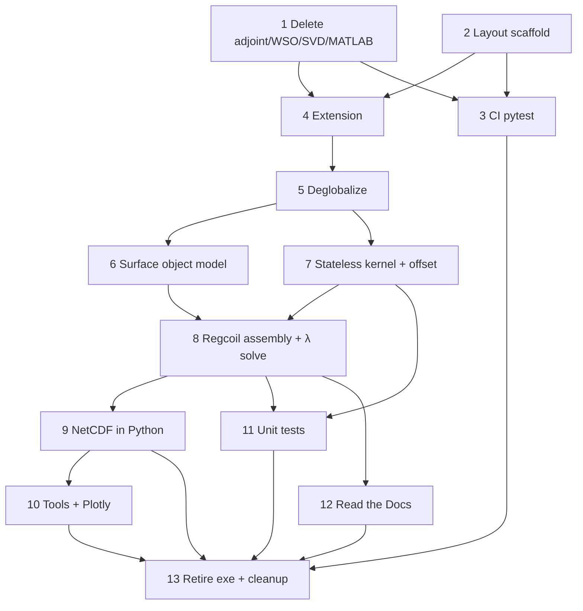

# Migration phases

Ordered work packages for the overhaul. Each phase should be a reviewable PR (or a short stack). Update the status column as work lands.

> **Architecture pivot (2026-07-18).** Phases 6+ were re-planned to match the
> object-model / stateless-Fortran-kernel design in [API.md](API.md) (ADR-019,
> ADR-020, ADR-021, ADR-022). The pending-phase list below replaces the earlier
> "namelist/JSON driver → SciPy Brent → NetCDF" plan. Phases 0–5 stay as
> completed; see **Reconciliation with completed phases 4–5** below for what of
> that work is superseded and where it is removed.

| Phase | Status | Depends on |
|-------|--------|------------|
| 0 Inventory freeze | done (see INVENTORY.md) | — |
| 1 Delete adjoint / WSO / SVD / MATLAB (except plotly port source) | done | — |
| 2 Layout + packaging scaffold | done | — |
| 3 CI + pytest scaffold | done | 2 helpful; can start after 1 |
| 4 Fortran as library + Python bindings (still may use globals) | done | 1, 2 |
| 5 Deglobalize Fortran state (instances) | done | 4 |
| 6 Python surface object model (`Surface`/`FourierSurface`/`Plasma`/`Coil`) | done | 5 (mostly independent) |
| 7 Slim stateless Fortran kernel + offset surface | done | 5 |
| 8 Python `Regcoil` assembly + λ-family solve | done | 6, 7 |
| 9 Save/load (object serialization); strip Fortran NetCDF/LAPACK | done | 8 |
| 10 Package tools (plot, compare, cut) + Plotly coil plot | done | 9 helpful |
| 11 Unit tests (Python + Fortran kernels) | done | 7+; continuous afterward |
| 12 Read the Docs manual | done | 8 helpful |
| 13 Retire Fortran executable + delete legacy Fortran + final cleanup | done | 8–12, CI green |

---

## Reconciliation with completed phases 4–5

Phases 4–5 wrapped the **existing** in-Fortran pipeline (`regcoil_build_matrices`,
`regcoil_prepare_solve`, `regcoil_solve`, `regcoil_diagnostics`) behind an opaque
`type(regcoil_t)` handle and a handle-based C API (`regcoil_c_create`,
`regcoil_c_setup`, `regcoil_c_solve_lambda`, …). The new architecture narrows the
Fortran boundary to 2–3 **stateless pure functions** and moves every matrix
product, the solve, the diagnostics, and the λ scan to numpy/scipy. Therefore:

- `regcoil_variables.f90`, the `regcoil_t` handle API, and the in-Fortran
  solve/prepare/diagnostics are **superseded** (ADR-018 → ADR-020) and get removed
  across Phases 7–9 and 13 — not carried forward.
- `iso_c_binding` + `regcoil._core` (ADR-017) and `meson-python` (ADR-002) **stay**;
  only the *number and shape* of entry points change (from a stateful handle to
  stateless kernels).
- Keep the legacy Fortran `program regcoil` and its NetCDF output building until
  Python-path parity is proven (ADR-006), then remove in Phase 13.

---

## Phase 0 — Inventory freeze

**Done** in [INVENTORY.md](INVENTORY.md).

Exit criteria:

- [x] Module roles listed.
- [x] Kill lists for adjoint / WSO / SVD / MATLAB.
- [x] NetCDF and globals touch points noted.

---

## Phase 1 — Remove adjoint, WSO, SVD scan, and MATLAB (bulk)

**Intent:** Shrink scope before wrapping and packaging.

**Delete / stop compiling:**

- Adjoint / sensitivity: `regcoil_adjoint_solve.f90`, `regcoil_init_sensitivity.f90`, `regcoil_fixed_norm_sensitivity.f90`, related branches, namelist keys, `manual/adjoint.tex`
- `windingSurfaceOptimization/` (entire tree)
- SVD: `regcoil_svd_scan.f90`, `general_option == 3` paths, related validate/output branches
- MATLAB: all `*.m` including `coilMetricScripts/`, `regcoil.m`, `m20160811_02_*.m`
  - **Exception:** keep `m20160811_01_plotCoilsFromRegcoil.m` only until Phase 9 ports it to Plotly, then delete

Exit criteria:

- [x] No sensitivity / adjoint / SVD scan in the default build.
- [x] Non-deleted examples still pass via current `make test` (or successor).
- [x] MATLAB tree gone except the temporary Plotly-port source (or already ported).

---

## Phase 2 — Directory layout and packaging scaffold

**Intent:** Introduce the target tree without changing physics.

```text
pyproject.toml
src/regcoil/            # Python package
fortran/                # REGCOIL + trimmed mini_libstell
tests/                  # pytest (unit + integration)
examples/               # regression cases
docs/                   # RTD sources + migration/
.github/workflows/      # CI
```

Allowed runtime deps in `pyproject.toml`: `numpy`, `scipy`, `matplotlib`, `f90nml`, `plotly`, optional `netCDF4`. Dev: `pytest`. No SIMSOPT/DESC.

Exit criteria:

- [x] `pyproject.toml` + build-backend choice recorded (ADR-002).
- [x] Layout in place; README has install/dev stubs.
- [x] Dependency list matches [OVERVIEW.md](OVERVIEW.md) principles.

---

## Phase 3 — GitHub Actions + pytest scaffold

**Intent:** CI early; migrate example runner toward pytest.

Today: `make test` → `examples/runExamples.py`. Legacy docs workflow `publish_manual.yml` is removed in Phase 11 (do not extend it).

CI strategy (ADR-016): build the legacy Fortran executable and run pytest smoke on both `ubuntu-latest` and `macos-latest`. Full example regressions stay local (`make test`) for now; wire them into GHA in a later pass.

Exit criteria:

- [x] GHA builds on `ubuntu-latest` (gfortran, BLAS/LAPACK; NetCDF Fortran only until Phase 8).
- [x] GHA builds on `macos-latest`.
- [x] pytest discovers at least a smoke test (example suite in CI deferred; see ADR-016).

---

## Phase 4 — Fortran library + Python extension

**Intent:** Importable extension; old executable may remain for parity.

Expose: build matrices, prepare/solve, per-λ diagnostics / residual metrics.

Globals may still exist here; Phase 5 removes them.

Exit criteria:

- [x] `import regcoil._core` (or similar) works after `pip install`.
- [x] One-λ solve matches a known example within tolerance.
- [x] CI installs via pip, not hand-invoked makefile alone.

---

## Phase 5 — Deglobalize Fortran state

**Intent:** Multiple independent problem instances in one process.

Replace `regcoil_variables` module globals with a derived type (or explicit argument bundles) passed through the call chain. Python mirrors this with `RegcoilProblem` holding extension state / handle.

Exit criteria:

- [x] No mutable problem state in Fortran `module` variables for normal solves.
- [x] Test: two instances with different resolutions/λ produce correct, non-interfering results.
- [x] Documented pattern for new Fortran routines (state as first argument / type components).

See ADR-018 for nested types (`plasma` / `coil` / `input` / `output` / `work`), opaque C handles, and the `prob`-first calling convention.

---

## Phase 6 — Python surface object model

**Intent:** The user-facing geometry layer, in pure Python/numpy, replacing the
Fortran geometry-init and the input-file readers. No Fortran dependency (except
`from_uniform_offset`, which lands in Phase 7).

- `Surface` (ABC): the contract is `_evaluate(theta, zetal) -> {r, drdtheta,
  drdzeta}`, each `(3, ntheta, nzetal)`, Cartesian. Base class supplies `normal`,
  `norm_normal`, `area`, `volume`, `dtheta`, `dzeta`, the grids, and plotting.
  **No `nderiv` / second derivatives** (Laplace–Beltrami removed, ADR-022).
- `FourierSurface(Surface)`: holds `mnmax, xm, xn, rmnc, rmns, zmnc, zmns`;
  `_evaluate` is the numpy gemm. Alternate constructors (classmethods) replace the
  `geometry_option_*` codes: `circular_torus`, `from_wout` (`mesh="full"|"half"`,
  `straight_field_line=`), `from_ascii_table`, `from_focus`,
  `from_nescin`. VMEC `wout` / nescin / FOCUS reading is **Python** (ADR-004 lib).
- `PlasmaSurface(FourierSurface)`: `Bnormal_from_plasma_current` via bnorm file
  (`set_bnormal_from_bnorm_file`), FOCUS modes, or user array;
  `net_poloidal_current_Amperes`, `curpol`.
- `CoilSurface(FourierSurface)`: coil-side Fourier filtering; `from_uniform_offset`
  wired in Phase 7.
- Qualitative options are **string enums** in the Python API (carries forward the
  string-option spirit of ADR-009; the namelist/integer-translation machinery is
  dropped with ADR-019).

Exit criteria:

- [x] `PlasmaSurface.from_wout(...)` and `CoilSurface.from_nescin(...)` reproduce
      the legacy surface grids (`r`, `normal`, `area`) within tolerance.
- [x] `circular_torus`, `from_focus`, bnorm loading covered by unit tests.
- [x] `_evaluate` numpy gemm matches a small hand-checked case; `xn`/`nfp` and
      `m·θ − n·ζ` conventions asserted (see [API.md](API.md) conventions).

**Status: done.** `Surface` (ABC), `FourierSurface`, `PlasmaSurface`, `CoilSurface`
implemented in `src/regcoil/{surface,fourier_surface,plasma_surface,coil_surface,_io}.py`,
exported from `regcoil/__init__.py`. Constructors landed: `circular_torus`,
`from_wout` (`mesh="full"|"half"`), `from_ascii_table`, `from_focus` (surface +
Bnormal modes), `from_nescin`, plus `set_bnormal_from_bnorm_file` and coil-side
`filter_modes`. `r`/`normal`/`area`/`volume` for `from_wout` and `from_nescin`
are checked in `tests/unit/` against the legacy Fortran (`regcoil_init_plasma`/
`regcoil_init_coil_surface`, compiled standalone and run outside the package
build for comparison, since this exit criteria doesn't require the (still
unbuilt) `_core` extension). **Not implemented, by design (see ADR-023):**
`from_efit` (legacy dropped EFIT support, no reference to validate against),
`from_wout(straight_field_line=True)` (legacy root-solve not robust enough to
port with confidence), `CoilSurface.from_uniform_offset` (needs the Fortran
kernel added in Phase 7, per the original plan).

---

## Phase 7 — Slim stateless Fortran kernel + offset surface

**Intent:** Shrink the Fortran boundary to 2–3 **pure** functions; retire the
globals-coupled build and the in-Fortran solve chain.

- `regcoil_build_g_and_h`: fused `inductance @ basis_functions` → `g`, `h`.
  Blocked internal loop (DGEMM per plasma-row chunk -- faster than the
  `matmul` intrinsic), OpenMP over plasma rows, GIL released (threadsafe).
  `intent(in)/(out)` only, extents explicit, **`info`** return, no `stop`, no
  module state.
- `regcoil_build_inductance`: same args minus `basis_functions`, returns the full
  matrix — a **separate** debug/regression entry point.
- `regcoil_uniform_offset_surface`: returns **Fourier coefficients**
  (`mnmax_out = mpol_out*(2*ntor_out+1) + ntor_out + 1`, deterministic), so a
  uniform-offset coil is an ordinary `FourierSurface`. Wire
  `CoilSurface.from_uniform_offset`.
- Extend the `bind(C)` layer (`fortran/regcoil_c_api.f90`, `src/regcoil/_core.c`)
  with these stateless entry points; a nonzero `info` becomes a Python exception.
  Assert `f_contiguous` at the boundary.
- Begin removing the superseded path: stop compiling `regcoil_variables`-coupled
  `regcoil_build_matrices`/`prepare_solve`/`solve`/`diagnostics` from the extension
  (final deletion in Phase 13; the legacy executable may still use them per ADR-006).
  Audit `regcoil_fzero.f`: keep only if the offset root-solve needs it.

Exit criteria:

- [x] `build_g_and_h(...)` equals `build_inductance(...) @ basis_functions` within
      tolerance on a manufactured case.
- [x] `uniform_offset_surface(...)` coefficients match the legacy offset routine.
- [x] `build_g_and_h(...)` output matches golden reference output of legacy Fortran routine
      within tolerance on a small case.
- [x] Unit tests for `regcoil_fzero.f`, assuming it is kept for `uniform_offset_surface(...)`.
- [x] Kernels are callable from `regcoil._core` with no persistent Fortran state;
      two concurrent calls with different sizes do not interfere.

**Status: done.** `regcoil_build_inductance` and `regcoil_build_g_and_h`
(`fortran/regcoil_kernels_mod.f90`) and `regcoil_uniform_offset_surface`
(`fortran/regcoil_uniform_offset_surface_mod.f90`) are pure/stateless: explicit
extents, `info` return, no `stop`, no module state, OpenMP over plasma rows
(`build_g_and_h`) or grid points (`uniform_offset_surface`). `build_g_and_h`
contracts one plasma-row chunk at a time against DGEMM (chosen over the
`matmul` intrinsic for performance), so the full inductance matrix is never
materialized; `regcoil_fzero.f` is kept and exercised by
`uniform_offset_surface`'s per-point root solve. `fortran/regcoil_c_api.f90` /
`src/regcoil/_core.c` expose all three as module-level `regcoil._core`
functions (no opaque handle -- ADR-020 supersedes the Phase 5 handle API, so
`RegcoilProblem` and its namelist-driven setup/solve chain are removed, along
with `tests/test_core_one_lambda.py`); a nonzero Fortran `info` becomes a
Python exception, and large arrays (`r_plasma`, `r_coil`, `basis_functions`,
...) must already be float64/Fortran-contiguous (`ValueError`/`TypeError`
otherwise, no silent copy) while small mode-number/coefficient arrays are cast
for convenience. `fortran/meson.build`'s extension source list is slimmed to
just what these kernels need (`regcoil_fzero.f`, the two new kernel modules,
`regcoil_c_api.f90`, plus `stel_kinds`/`stel_constants`); the
`regcoil_variables`-coupled build/solve chain, VMEC/nescin/bnorm reading, and
NetCDF modules are no longer compiled into the extension (still built for the
legacy executable via the makefile's own source list, untouched, per ADR-006).
`CoilSurface.from_uniform_offset` is wired in `src/regcoil/coil_surface.py`.
Golden values in `tests/unit/_golden_kernels.py` were generated the same way
as Phase 6's (a standalone driver linking the legacy
`regcoil_build_matrices` / `regcoil_init_coil_surface`, compiled and run
outside the package build); `tests/unit/test_kernels.py` checks
`build_g_and_h` against `build_inductance(...) @ basis_functions`, both
against the golden legacy values, `uniform_offset_surface` against a
non-circular (helical-bump) golden legacy case that forces a genuine
`regcoil_fzero` root solve, an exact analytic circular-torus check, the
`CoilSurface.from_uniform_offset` wiring, boundary-validation error paths, and
non-interference across two different problem sizes.

---

## Phase 8 — Python `Regcoil` assembly + λ-family solve

**Intent:** Assemble and solve entirely in numpy/scipy; the λ scan and target
search are free after one eigendecomposition. Replaces the former "SciPy Brent"
phase (ADR-021 supersedes ADR-003).

- `Regcoil(plasma, coil, mpol_potential, ntor_potential, net_poloidal_current,
  net_toroidal_current, stellarator_symmetric)`: builds `basis_functions` and the potential
  modes (numpy), calls `regcoil_build_g_and_h` for `g`/`h`, forms
  `matrix_B = gᵀ(g/N)`, `matrix_K = Σ fᵢᵀ(fᵢ/N)`, `RHS_B`, `RHS_K`, and computes
  `w, V = scipy.linalg.eigh(matrix_B, matrix_K)`. **Immutable** thereafter.
- `Solution` (frozen dataclass): `lam`, `solution`,
  `single_valued_current_potential_mn`, `f_B`, `f_K`, `max_K`, `rms_K`,
  `max_Bnormal`, `Bnormal_total`; lazy `current_potential()` / `current_density()`.
- `solve(lam)`, `scan(lambdas)` (vectorized), `solve_for_target(metric, value)`
  (bisection/Newton on the closed-form `chi2`/`max_K` vs λ). No Fortran Brent,
  no `regcoil_lambda_scan`, no `regcoil_auto_regularization_solve`.
- Keep the non-stellarator-symmetry option (`stellarator_symmetric` ∈ {True, False}, ADR-019).
- For tests that the new python-based solver matches the legacy fortran solver,
  you can use existing golden reference values from the files
  /examples/*/tests.py, as the reference values in those files were taken by
  hand from the fortran solver.
- Re-wire the regression tests in /tests/regression to use the new python solver
  instead of the legacy fortran solver. Mark the tests with ntheta_plasma=128 as
  "slow" in pytest and the github actions CI skips these tests, but they are
  available for a user to run by hand if desired.
- For the lambda-search examples in /examples (general_option = 5), the order of lambda values for
  the search will almost certainly be different with the new python solver than
  with the legacy Fortran solver, so tests can cover just the final converged
  value of lambda, and if possible the large-lambda and zero-lambda limits, but
  the intermediate lambda values and the specific order of lambda values may
  differ.

Exit criteria:

- [x] One-λ solve matches a legacy example within tolerance.
- [x] `scan(...)` matches per-λ direct solves; `solve_for_target(...)` matches the
      legacy `lambda_search_*` results within tolerance.
- [x] Two `Regcoil` instances with different resolutions coexist and don't
      interfere (no shared state, kernel is stateless).
- [x] Regression tests in /tests/regression/ pass, use the new python solver,
      and all asserted values from the /examples/*/tests.py files are encoded in
      the tests/regression/ tests, except that non-converged lambda values may
      be skipped in the lambda-search examples.

**Status: done.** `Regcoil`/`Solution` implemented in `src/regcoil/regcoil.py`:
basis functions, `matrix_B`/`matrix_K`/`RHS_B`/`RHS_K` assembly, and the λ
family solve are numpy/scipy; the only Fortran call is
`regcoil._core.build_g_and_h` (Phase 7). `solve(lam)` (including `lam=np.inf`,
the well-defined heavily-regularized limit) and `scan(lambdas)` share the
cached `scipy.linalg.eigh(matrix_B, matrix_K)` eigendecomposition;
`solve_for_target(metric, value)` bisects in `log(lambda)` and raises
`ValueError` for an unreachable target (see ADR-024) rather than porting the
legacy staged Brent search. `Solution.current_potential()`/`current_density()`
are lazy grid expansions; `f_B`/`f_K`/`max_K`/`rms_K`/`max_Bnormal`/
`Bnormal_total` are eager (computed once per solve, matching legacy
diagnostics). Regression tests under `tests/regression/*/test_regression.py`
build the problem directly via the object model (no legacy executable, no
NetCDF) and check against golden values read from `examples/*/tests.py`
(programmatically extracted into `_golden.py` for the largest arrays, to
avoid hand-transcription errors); the four `ntheta_plasma=128` cases are
`@pytest.mark.slow` and skipped in CI (`pytest -m "not slow"`, `.github/workflows/ci.yml`).
`tests/unit/test_regcoil.py` covers the object-model behavior independent of
any golden legacy value (basis-function/mode-count sanity, `scan` vs. `solve`
consistency, two-instance non-interference, `solve_for_target` bracketing).
See ADR-024 for the f_K-only regularization, the `ValueError`-on-unreachable-target
design, and the `geometry_option_coil=4` approximation.

---

## Phase 9 — Save / load (object serialization); strip Fortran NetCDF/LAPACK

**Intent:** Persist and restore the object model — `PlasmaSurface`,
`CoilSurface`, `Regcoil`, `Solution`, and the `SolutionScan` from a λ scan —
typically all together in one file, optionally one object at a time. A saved run
is a self-contained data product: everything a user might plot (surface shapes,
cross-sections, the `f_B`/`f_K` and `max_Bnormal`/`max_K` Pareto fronts, the
current potential / current density / `Bnormal` on the `(θ, ζ)` grid) must load
in ~1 s at 128×128 **without any Fortran kernel or expensive BLAS**, and be
readable by generic tooling (`xarray`, `h5py`) with no `regcoil` import. Format,
schema, and the store-vs-recompute rule are fixed by **ADR-028** (see also
[API.md](API.md#saving-and-loading)). This phase also finishes the Fortran-side
cleanup that all-Python I/O unblocks: the extension ends up linking only the
Fortran runtime, OpenMP, and BLAS (BLAS stays for `regcoil_build_g_and_h`'s DGEMM;
LAPACK and NetCDF have no permanent consumer and go away).

**Serialization (ADR-028):**

1. **Format: NetCDF-4 via `h5netcdf`** (a required dependency for I/O; the core
   solve stays independent of it). No attempt to preserve the legacy Fortran
   `regcoil_out.*.nc` layout — this is a fresh Python-defined schema with named
   dimensions, grouped by object (`/plasma`, `/coil`, `/problem`, `/solutions`),
   each group tagged `_class` and the root tagged `format_version`.
2. **API:** module-level `regcoil.save(path, *, plasma=None, coil=None,
   problem=None, solutions=None)` (writes only the groups given, deduping the
   shared problem/surfaces — an N-λ scan stores its `Regcoil`, plasma, and coil
   once) and `regcoil.load(path) -> container` (`.plasma`, `.coil`, `.problem`,
   `.solutions`, any of which may be `None`; `.solutions` is a `SolutionScan`).
   Thin `obj.save(path)` methods and `Class.load(path)` delegate to these.
3. **Store the source of truth + only the derived quantities whose recompute
   needs the Fortran kernel or the big operators (`g`, `h`, `matrix_B/K`, `V`);
   the big operators are never saved.** Surfaces store their Fourier modes (plus
   the plasma's `Bnormal_from_plasma_current`, `net_poloidal_current`, `curpol`);
   `/problem` stores the scalar parameters **and `Bnormal_from_net_coil_currents`**
   (needs `h`, so it can't be recomputed cheaply — added by ADR-028's Phase-10
   amendment); `/solutions` is flattened along a `lambda` dimension and stores
   `lam`, `solution` (amplitudes), `f_B`/`f_K`/`max_K`/`rms_K`/`max_Bnormal`, and
   the result-sized grids `Bnormal_total`, `current_potential`, `current_density`.
4. **Split `Regcoil.__init__`** into a cheap assembly (surfaces, potential modes,
   `basis_functions`, `f_all`, `d_xyz`) and an expensive one (`build_g_and_h`,
   `matrix_B/K`, `eigh`), so `load()` runs only the cheap part and loaded
   Solutions plot with no kernel; operators rebuild lazily only if a *new* λ is
   solved on the loaded object.
5. Add `SolutionScan` (a `Sequence[Solution]` with columnar `.lam`/`.f_B`/… array
   accessors) as the return type of `Regcoil.scan()` and `regcoil.load()`.

**Fortran-side cleanup (unblocked by all-Python I/O):**

6. VMEC `wout` ingest is already Python (Phase 6, ADR-004); confirm no Fortran
   NetCDF is reached on the supported path.
7. Strip `ezcdf` / `NETCDF` and the NetCDF `read_wout` path from the extension.
8. Remove `mini_libstell`, relocating any essential kinds/constants to the Fortran
   files kept in the end — see ADR-005.

Exit criteria:

- [x] `regcoil.save(..., solutions=scan)` writes one file with all four object
      kinds; `regcoil.load(...)` round-trips them (surfaces, problem params, and
      every `Solution` field) within tolerance.
- [x] A round-tripped run reproduces every plot-target quantity (surface grids,
      current potential/density, `Bnormal_total`, `Bnormal_from_net_coil_currents`,
      the Pareto scalars) with **no** `build_g_and_h` / `eigh` / DGEMM call.
- [x] `plasma.save`/`prob.save`/`sol.save` and the per-class `load` handle the
      single-object (subset) case.
- [x] Extension links only the compiler runtime, OpenMP, and BLAS (no LAPACK, no NetCDF).
- [x] CI does not install Fortran NetCDF for the package build.

**Status: done.** `regcoil.save`/`regcoil.load` (`src/regcoil/_serialize.py`)
implement the ADR-028 schema (`/plasma`, `/coil`, `/problem`, `/solutions`
groups, NetCDF-4 via `h5netcdf`, `format_version` + `_class` tags); thin
`obj.save(path)` / `Class.load(path)` methods on `PlasmaSurface`,
`CoilSurface`, `Regcoil`, and `Solution` delegate to it, handling the
single-object case (`Solution.load` raises `ValueError` on a multi-lambda
file, matching the `Class.load` "errors if that group is missing/ambiguous"
contract). `Regcoil.__init__` is split into `_init_cheap` (surfaces,
potential modes, `basis_functions`, `f_all`, `d_xyz`) and `_build_operators`
(`build_g_and_h`, `matrix_B/K`, `eigh`); `regcoil.load()` reconstructs via
`Regcoil._from_loaded`, running only the cheap part and taking
`Bnormal_from_net_coil_currents` from disk, so a loaded run's Solutions
(which already carry their stored `current_potential`/`current_density`/
`Bnormal_total` grids) need no kernel/eigh/DGEMM call; `_ensure_operators`
rebuilds the operators lazily, with a log message, only if `solve()`/
`scan()`/`solve_for_target()` is called on a loaded `Regcoil`.
`Regcoil.scan()` now returns a `SolutionScan` (`Sequence[Solution]` plus
columnar `.lam`/`.f_B`/`.f_K`/`.max_K`/`.rms_K`/`.max_Bnormal`), also
returned by `regcoil.load(...).solutions`. `tests/unit/test_serialize.py`
covers the full-bundle round trip (every stored field, byte-for-byte via
`np.testing.assert_allclose`), the "no kernel/eigh" promise (via
monkeypatching `_core.build_g_and_h`/`scipy.linalg.eigh` to raise), a
non-`standard_toroidal_angle` coil surface (nonzero `nu` modes, ADR-026),
the four single-object save/load paths, per-class `load` error paths, and
the transitive plasma/coil/problem dedup for a scan. Root `meson.build` now
declares only `openmp_dep`/`blas_dep` (`fc.find_library('blas')` or, on
macOS, the `Accelerate` framework when no BLAS pkg-config file is found) --
`netcdf_dep`/`netcdff_dep`/`lapack_dep` and the `-DNETCDF` flag are gone, so
the extension links only the compiler runtime, OpenMP, and BLAS (verified
via `otool -L _core*.so`); the legacy `program regcoil` executable (built
separately by the root `makefile`, ADR-006) is untouched and still needs
NetCDF/LAPACK until Phase 13, so CI's `apt`/`brew` install steps are
unchanged, but the package-build step no longer requires those libraries to
succeed. `h5netcdf` is added to `pyproject.toml`'s runtime dependencies
(ADR-028) but imported lazily inside `_serialize.py`'s functions, so
`import regcoil` and the core solve stay independent of it. Bullets 6–7
(confirm no Fortran NetCDF on the VMEC-read path; strip `ezcdf`/`NETCDF`
from the extension) were already true at the Fortran-source level going
into this phase (`fortran/meson.build`'s `regcoil_lib_src` never included
`ezcdf`/VMEC-read files) -- what remained, and is now fixed, was the
top-level `meson.build` still linking the unused libraries. Bullet 8
(`mini_libstell` removal) is **not** done here: PHASES.md's own Phase 13
exit criteria separately lists "mini_libstell is completely removed", the
directory is still required by the root `makefile`'s legacy-executable
build (`LIBSTELL_DIR`/`mini_libstell.a`) per ADR-006, and ADR-005 (its
disposition) is still `proposed`/TBD -- so it is left in place and deferred
to Phase 13, consistent with the actual (checked) exit criteria above, which
do not mention it.

---

## Phase 10 — Plotting, comparison, coil cutting + a single `regcoil` CLI

**Intent:** First-class Python visualization/tooling that consumes the object
model; no standalone-script requirement; no MATLAB left. Architecture is fixed by
**ADR-029** (see also [API.md](API.md#plotting-and-visualization)).

**Design invariants (ADR-029):**

- **Object model only.** Every plotting function takes in-memory objects
  (`PlasmaSurface`/`CoilSurface`/`Regcoil`/`Solution`/`SolutionScan`) or the
  `regcoil.load()` container — never file paths or raw `xarray`. A live run and a
  saved-then-loaded run present one identical interface (ADR-028 cheap-assembly
  split), so **no plot needs a Fortran kernel or expensive BLAS**.
- **Hybrid placement.** Canonical free functions in `regcoil.plot`; thin
  `obj.plot_*()` methods delegate to them. matplotlib/plotly are imported **lazily
  inside** the functions so `import regcoil` stays plotting-free.
- **Atomic functions return `ax=`/`fig=`; dashboards compose them.** The λ-scan
  panel grids and `plot.all()` only lay out subplots and call the atomic
  functions — no duplicated plotting logic. This is what makes "one plot at a
  time," the multi-panel grids, overlaying several runs, and "plot everything"
  share one code path.
- **matplotlib for 2D, Plotly for 3D interactive.** `regcoil.plot.DEFAULT_FIGSIZE
  = (14.5, 8.1)` is used whenever a matplotlib function must create its own figure.

**Deliverables (replacing the legacy scripts):**

- `regcoil.plot` module — atomic functions for: `cross_section` (matplotlib;
  default `phi = np.array([0, 0.5, 1, 1.5]) * np.pi / nfp`, user-overridable, via a
  new `Surface.cross_section(phi) -> (R, Z)` that handles both
  `standard_toroidal_angle` values, ADR-025); `pareto` (one or several
  `SolutionScan`s overlaid; selectable `x`/`y` among `f_B`, `f_K`, `max_Bnormal`,
  `max_K`); `lambda_scan` (the f_B/f_K-vs-λ traces); `current_potential`
  (`single_valued`/`total`), `current_density`, `bnormal`
  (`plasma_current`/`net_coil`/`total`) atomic `(θ, ζ)` maps plus their
  `*_scan` multi-λ grids; `plot_3d` (Plotly, plots **any subset** of {plasma
  surface, winding surface, cut coils} in one view via `plasma=`,
  `winding_surface=`, `coils=`, with `winding_surface_style` ∈
  `wireframe`/`translucent`/`solid`); and `all()`/`dashboard()` composition. Replaces
  `regcoilPlot` and `compareRegcoil`.
- `regcoil.cut` module — `cut(solution, coils_per_half_period, thickness=..., ...)
  -> CutCoils` (contour Φ → 3D curves → finite-thickness ribbons);
  `CutCoils.save_makegrid(path)`. Replaces `cutCoilsFromRegcoil` /
  `cut_saddle_coil`. Cutting (compute + MAKEGRID export) is separate from plotting;
  `plot.plot_3d(coils=...)` / `plot.coil_3d(...)` renders it (the Plotly port of
  `m20160811_01_plotCoilsFromRegcoil.m`).
- **Single `regcoil` CLI** with subcommands (`regcoil plot|compare|cut|...`), each
  a thin `load() → plot/cut → show/save` wrapper. No separate
  `regcoilPlot`/`compareRegcoil` console names.
- ADR-028 (amended) stores `Bnormal_from_net_coil_currents` in `/problem` so the
  `bnormal(component="net_coil")` panel loads without a kernel call.

Exit criteria:

- [x] `regcoil.plot` atomic functions work on both a live run and a
      round-tripped saved run, calling no Fortran kernel / no `eigh` / no
      `build_g_and_h` in the saved-run path.
- [x] Each atomic function accepts `ax=`/`fig=` and returns it; `plot.all()` is
      built by composition; `plot.pareto([...])` overlays multiple runs.
- [x] `plot.plot_3d(...)` renders any subset of {plasma, winding surface, cut
      coils}, including the finite-thickness Plotly coil figure against a sample run.
- [x] `regcoil.cut(...)` reproduces a MAKEGRID `coils.*` file for a sample run.
- [x] Tools invocable via the single `regcoil` console script.
- [x] Zero `*.m` files in the repo.

**Status: done.** `src/regcoil/plot.py` holds the atomic functions
(`cross_section`, `pareto`, `lambda_scan`, `current_potential`,
`current_density`, `bnormal`, plus the `current_potential_scan`/
`bnormal_scan` multi-lambda grids and `plot_3d`) and `all()`/`dashboard()`,
all built by composing the atomics (no duplicated plotting logic); each
accepts `ax=` (matplotlib) or `fig=` (plotly) and returns it, and
matplotlib/plotly are imported lazily inside the functions so `import
regcoil` stays plotting-free. `Surface.cross_section(phi)`
(`src/regcoil/surface.py`) derives `phi = atan2(y, x)` from the actual
Cartesian `r` grid and interpolates each theta-line to the requested
physical angle(s), correct for both `standard_toroidal_angle` values
(ADR-025/026) -- checked against the analytic circular-torus cross section
and, for a `standard_toroidal_angle=False` coil surface, against `atan2`
directly (`tests/unit/test_surface.py`). `src/regcoil/cut.py` implements
`cut(solution, coils_per_half_period, thickness=None, theta_shift=0) ->
CutCoils`: `contourpy` traces `2*coils_per_half_period` closed contours of
the period-normalized total current potential on a 3-field-period-wide
extension (so a contour winding across the period seam closes correctly,
matching the legacy `cutCoilsFromRegcoil` construction), replicates them
across all `nfp` periods, and maps `(theta, zeta)` points to 3D via the new
`FourierSurface.evaluate_at` (pointwise evaluation at arbitrary paired
points, as opposed to `_evaluate`'s tensor-product grid -- needed since
contour points aren't a regular grid). `CutCoils.save_makegrid(path)`
replaces the legacy file write; `thickness=` builds finite-thickness ribbon
corners from the local surface-normal and curve-binormal (the Plotly port of
`m20160811_01_plotCoilsFromRegcoil.m`'s offset construction), rendered by
`plot.plot_3d(coils=...)`/`plot.coil_3d(...)`. Thin `obj.plot_*()` /
`obj.cut()` convenience methods delegate to these free functions from
`Surface`, `Solution`, `SolutionScan`, and `CutCoils` (ADR-029 hybrid
placement). The single `regcoil` console script (`src/regcoil/_cli.py`,
registered via `[project.scripts]`) provides `regcoil plot|compare|cut`,
each a thin `load() -> plot/cut -> show/save` wrapper -- no separate
`regcoilPlot`/`compareRegcoil` console names. The legacy
`regcoilPlot`/`compareRegcoil`/`cutCoilsFromRegcoil`/`cut_saddle_coil`
scripts and `m20160811_01_plotCoilsFromRegcoil.m` are deleted (zero `*.m`
files remain in the repo). Tests: `tests/unit/test_plot.py`,
`test_cut.py`, `test_cli.py`, and additions to `test_surface.py` cover the
`ax=`/`fig=` contract, `pareto`'s multi-scan overlay, `plot_3d` rendering
any subset of {plasma, winding surface, cut coils}, the coil count/current/
MAKEGRID-format checks for `cut()`, and -- reusing the `test_serialize.py`
kernel/`eigh`-forbidding monkeypatch pattern -- that every plot function and
`cut()` need no Fortran kernel or eigendecomposition on a round-tripped
saved run.

---

## Phase 11 — Unit tests (ongoing)

**Intent:** Not only example regressions.

- **Python:** pytest unit tests for the surface object model (`_evaluate` gemm,
  `normal`/`area`/`volume`, constructors, conventions), Bnormal loaders, basis-
  function / matrix assembly, the closed-form λ family vs direct solves, and
  NetCDF round-trip; plotting smoke (non-interactive backends).
- **Fortran kernels:** exercise `build_g_and_h` / `build_inductance` /
  `uniform_offset_surface` via `regcoil._core` with small manufactured inputs
  **or** a Fortran unit-test framework (ADR-008). Prefer minimal new deps.

Exit criteria:

- [x] `pytest` layout under `tests/`.
- [x] At least a handful of true unit tests (not only full examples) for the
      Python object model and for the Fortran kernels.
- [x] CI runs unit + example suites.

**Status** In good shape and we can proceed to later phases. We will continue to add tests for new code.

---

## Phase 12 — Read the Docs manual

**Intent:** Replace the LaTeX `manual/` with a Read the Docs manual for the Python
object-model API, and remove the old docs GitHub Actions workflow. Stack and the
runnable-code guarantee are fixed by **ADR-030** (which supersedes ADR-014).

**Stack (ADR-030):**

- **Sphinx + Read the Docs**, `furo` theme.
- **API reference** via `sphinx.ext.autosummary` with `:recursive:` +
  `:toctree: _api/`, grouped by topic with a one-line description per entry (the
  yancc `api.html` style); NumPy-style docstrings through `sphinx.ext.napoleon`;
  per-object **[source]** links via `sphinx.ext.linkcode` / `sphinx_github_style`.
- **Runnable docs.** Prose/tutorial pages are **jupytext-paired MyST-Markdown**
  (`.md`, no committed outputs) executed at build time by **MyST-NB** with
  `nb_execution_mode = "cache"` and `nb_execution_raise_on_error = True`, so a
  broken code cell fails the build. The `README.md` quickstart snippet is checked
  by `sphinx.ext.doctest`.
- **CI safety net.** A `docs` job runs `pytest --nbmake docs`, `sphinx-build -W`,
  and `make -C docs doctest` on the normal matrix — doc breakage surfaces in PRs
  independently of the RTD service.
- **Build environment.** `.readthedocs.yaml` installs `gfortran` +
  `libopenblas-dev` (`build.apt_packages`) and pip-installs the package with its
  `docs` extra so executed pages run the real Fortran path; `fail_on_warning: true`.
- **Cheap execution where possible.** Ship one or two small saved runs (`.nc`)
  under `docs/`; kernel-free pages `load()` + plot them and (per ADR-028) need no
  Fortran/BLAS. Only a single "construct + solve from scratch" tutorial exercises
  the compiled extension.

**Proposed `docs/` layout:**

```text
README.md                 # short quickstart (doctest-validated snippet)
.readthedocs.yaml         # apt gfortran+libopenblas, docs extra, fail_on_warning
docs/
  conf.py                 # autosummary + napoleon + myst_nb + furo + linkcode
  index.md                # includes README quickstart; toctrees
  installation.md         # pip + build deps (from the current README install section)
  quickstart.md           # fuller runnable quickstart (executed)
  usage.md                # typical workflow: surfaces → Regcoil → scan → save (executed)
  plotting.md             # every plot type: cross_section, pareto, lambda_scan,
                          #   current_potential(_scan), current_density,
                          #   bnormal(_scan), plot_3d, cut → coils (executed)
  api.md                  # yancc-style autosummary, grouped by topic
  theory.md               # essential physics ported from manual/*.tex
  _static/ , sample_run.nc
```

**Content:** port the essential physics/overview from `manual/overview.tex` (and
related `*.tex`) into `theory.md`; the API reference documents the object-model
API (surfaces, `Regcoil`, `Solution`, `SolutionScan`, `regcoil.plot`,
`regcoil.cut`, `regcoil.save`/`load`) and the **string options** — **no**
namelist/JSON input reference (ADR-019). Fold the untracked root scratch scripts
(`run_example.py`, `run_fast_example.py`, `run_slow_example.py`,
`test_cross_section_plot.py`) into the usage/plotting pages (or `examples/`), then
delete them from the repo root.

- **Delete** `.github/workflows/publish_manual.yml` (LaTeX → gh-pages) entirely;
  do not adapt it. Docs publishing is Read the Docs plus the CI `docs` job above.

Exit criteria:

- [x] `README.md` has a short quickstart, validated by `sphinx.ext.doctest` in CI.
- [x] Docs build on Read the Docs with the Fortran extension compiled;
      `fail_on_warning: true`.
- [x] Pages exist for installation, typical usage, **every** plot type, and an
      `autosummary` API reference in the yancc style; the reference documents the
      object-model API and the string options — no namelist/JSON input reference.
- [x] Every code cell in the docs is executed at build with
      `nb_execution_raise_on_error = True`, **and** runs under `pytest --nbmake`
      in the normal CI matrix; a `sphinx-build -W` smoke build passes.
- [x] Tutorial sources are plain-text jupytext MyST-Markdown with no committed
      cell outputs.
- [x] LaTeX `manual/` is no longer the canonical user doc.
- [x] `.github/workflows/publish_manual.yml` is removed from the repo.

**Status: done.** Sphinx + `furo` under `docs/` (`conf.py`, `index.md`,
`installation.md`, `quickstart.md`, `usage.md`, `plotting.md`, `theory.md`,
`api.md`); `.readthedocs.yaml` builds `gfortran`/BLAS/`pkg-config` and installs
`.[docs]` so RTD compiles the real extension (`fail_on_warning: true`).
`quickstart.md`/`usage.md`/`plotting.md` are jupytext-pairable MyST-Markdown
(standard `jupytext:`/`kernelspec` front matter) with **no committed cell
outputs**, executed by MyST-NB (`nb_execution_mode = "cache"`,
`nb_execution_raise_on_error = True`) against a small bundled example
(`regcoil.examples("NCSX")` at `ntheta=nzeta=24`) — every plotted figure, table
value, and printed number in the docs is produced live at build time, not
pasted in. `api.md` follows the yancc `api.html` pattern: grouped
`sphinx.ext.autosummary` tables (`:recursive:`, `:toctree: _api/`) covering
surfaces, `Regcoil`/`Solution`/`SolutionScan`, `regcoil.plot`, `regcoil.cut`,
save/load, the bundled-examples registry, and utilities; each entry's one-line
summary comes from its own NumPy-style docstring (`sphinx.ext.napoleon`), and
`sphinx.ext.linkcode` (hand-rolled `linkcode_resolve`, no extra dependency)
adds a per-object **[source]** link to the exact GitHub lines. The
`README.md` quickstart snippet is checked by `sphinx.ext.doctest`
(`sphinx-build -b doctest`); a second, independent CI safety net converts the
three executed pages to notebooks with `jupytext --to ipynb` and runs them
under `pytest --nbmake`, alongside a `sphinx-build -W` smoke build — added as
a new `docs` job in `.github/workflows/ci.yml`, run on every push/PR. Internal
migration-planning docs (`docs/migration/*.md`) are excluded from the built
site (`conf.py`'s `exclude_patterns`) since they are not user-facing.
`manual/` gets a `README.md` pointing at Read the Docs and noting it is no
longer canonical; `.github/workflows/publish_manual.yml` was already absent
(never existed in this migrated repo). The four untracked root scratch
scripts (`run_example.py`, `run_fast_example.py`, `run_slow_example.py`,
`test_cross_section_plot.py`, plus a stray editor backup) had their useful
patterns (bundled-example loading, `from_uniform_offset`, `cross_sections`
plotting) folded into `quickstart.md`/`usage.md`/`plotting.md`, then were
deleted.

Deviations from the plan above, decided while implementing (all verified
locally — `sphinx-build -W`, `sphinx-build -b doctest`, `pytest --nbmake`, and
the existing `pytest` suite all pass):

- **`libblas-dev`, not `libopenblas-dev`**, in `.readthedocs.yaml`/CI apt
  packages — matches `meson.build`'s actual `dependency('blas')` /
  `fc.find_library('blas')` lookup and the package already proven to work in
  `ci.yml`.
- **No committed `sample_run.nc`.** Building and solving a small
  (`ntheta=nzeta=24`) problem from a bundled example takes well under a
  second, so `quickstart.md`/`usage.md`/`plotting.md` construct their own tiny
  run from `regcoil.examples(...)` rather than loading a checked-in binary
  data file. This needs the compiled extension on every executed page rather
  than isolating that to one tutorial, but RTD compiles the extension
  regardless (decision 8), so the simplification costs nothing and avoids a
  binary blob in `docs/`.
- **`docs/migration/` excluded from the Sphinx build entirely**, rather than
  left in but unlinked, to avoid "not in any toctree" warnings under
  `fail_on_warning: true` and to keep engineering-process docs off the public
  site.
- **Plotly figures need `pio.renderers.default = "notebook_connected"`**
  (set once in `plotting.md`) so `plot_3d`/`coil_3d` emit a `text/html`
  mimebundle MyST-NB can embed, instead of the ipywidget-style
  `application/vnd.plotly.v1+json` output real Jupyter frontends understand
  but a static Sphinx page cannot render.
- **Fixed real docstring bugs surfaced by turning on autodoc**, since a
  reST-syntax error in any documented docstring is a hard build failure under
  `fail_on_warning`: bare `|N|`/`|m|`/`|n|` in `surface.py`/`coil_surface.py`
  parsed as (undefined) reST substitution references — wrapped in backticks;
  `FourierSurface` had no class docstring (was silently inheriting
  `Surface`'s via `inspect.getdoc`, but autosummary's table-summary
  extraction does not follow that inheritance) — added one.

---

## Phase 13 — Retire executable, delete legacy Fortran, final cleanup

**Done.** `fortran/` now holds only the stateless kernel boundary
(`regcoil_kinds_mod.f90`, `regcoil_fzero.f`, `regcoil_kernels_mod.f90`,
`regcoil_uniform_offset_surface_mod.f90`, `regcoil_c_api.f90`) plus its
`meson.build`. The root `makefile`/`makefile.depend`, the whole legacy
`regcoil_variables`-coupled chain (`regcoil.f90` and everything that took
`type(regcoil_t)`), `fortran/mini_libstell/`, and the now-orphaned
`examples/` directory (namelist inputs + `runExamples.py`, superseded by
`tests/regression/`) are deleted. CI no longer builds a Fortran executable.

Exit criteria:

- [x] Fortran `program regcoil` removed or unsupported.
- [x] `regcoil_variables.f90`, the `regcoil_t` handle API, and the in-Fortran
      solve/prepare/diagnostics + λ-search sources are deleted (superseded by the
      stateless kernels and the numpy/scipy solve).
- [x] mini_libstell is completely removed.
- [x] Packaging is the canonical build; makefile gone or developer-only.
- [x] README points at pip install, the scripting API, pytest, and RTD.
- [x] `publish_manual.yml` already gone (Phase 12); no leftover gh-pages LaTeX publish path.
- [x] Open ADRs resolved or explicitly deferred; migration docs marked complete.

---

## Parallelism notes



Phases 6 and 7 run in parallel (Python geometry vs Fortran kernel) and converge at
Phase 8. Phase 11 starts as soon as the surfaces and kernels exist and grows
continuously. Phase 10 can begin once NetCDF outputs are stable from Python.
